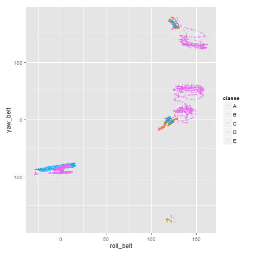

####Introduction
In this work we pretend to apply some routines of the R packages _randomForest_ and _caret_, to a problem of classification. Then we create a training dataset with 60% of total data. Based on subsamples of the training dataset, we build, train and evaluate several random forest models, using cross-validation as the first approach to decide if principal components pre-processing is or not necessary to achieve a better accuracy. Finally, we construct a final random forest model based in the totality of training dataset, and confirm the expected error rates.

####Data acquisition

```r
library(caret)
library(randomForest)
#Set the working directory
setwd("d:/Users/Camilo/Desktop/DataScience/MachineLearn")
#Create a directory "data"
if(!file.exists("data")) {
  dir.create("data")}
#Set the URLs to download the data and the name of the destination file
trainURL <- "https://d396qusza40orc.cloudfront.net/predmachlearn/pml-training.csv"
testURL <- "https://d396qusza40orc.cloudfront.net/predmachlearn/pml-testing.csv"
trainFile <- "./data/train.csv"
testFile <- "./data/test.csv"
#Download the data and report the download info
#download.file(trainURL, destfile = trainFile)
#download.file(testURL, destfile = testFile)
dateDownload <- date()
#Load the data
trainData <- read.csv(trainFile)
testData <- read.csv(testFile)
#Tidy the data and discard NA variables
trainData$classe <- factor(trainData$classe)
na.number <- numeric()
for(i in 1:dim(trainData)[2]){
  na.number[i] <- sum(is.na(trainData[,i]))}
training <- trainData[which(na.number == 0)]
testing <- testData[which(na.number == 0)]

#Discard useless variables (those who begin with words "amplitude", "kurtosis", "skewness",
#"min" and "max") and the first seven identifiers
useless <- grep("^amplitude|^kurtosis|^skewness|^min|^max", names(training), value=F)
useless <- c(1:7, useless)
training <- training[, -useless]
testing <- testing[, -useless]
```
Data were downloaded from https://d396qusza40orc.cloudfront.net/predmachlearn/pml-training.csv on Sun Nov 01 11:18:22 2015. 

####Cross-validation
60% of the data set was used to build and evaluate the models, and the other 40% was left to validate the obtained results. Ten times, we sample a 60% of the training dataset in order to build a random forest model, with and without principal components pre-processing. The accuracy obtained for each model in the other 40% of the training dataset, was saved for each random forest model.


```r
set.seed(20151025)
#Create a data partition and reserve the test dataset to assess the out-of-bag error
inTrain <- createDataPartition(y=training$classe, p=0.6, list=F)
train <- training[inTrain,]
test <- training[-inTrain,]

#Perform 10 simulations to compare the random forests algorithms with and without PCA
#pre-processing
nSimulations <- 10
results <- data.frame(accuracy=NA, pValue=NA, accuracyPCA=NA, pValuePCA=NA)
 
for(sim in 1:nSimulations){
  #For each simulation, generate a partition to train and test the models
  trainIndex <- createDataPartition(train$classe, p=0.60, list=F)
  trainSimulation <- train[trainIndex,]
  testSimulation <- train[-trainIndex,]
  #Create a random forest model with the partial training dataset
  rForestModel <- randomForest(classe ~ ., data=trainSimulation)
  #Predict for the partial testing dataset
  predictionRandomForest <- predict(rForestModel, testSimulation)
  #Save the accuracy of the prediction and its associated p-value the results dataframe
  results[sim, c("accuracy", "pValue")] <- 
    confusionMatrix(predictionRandomForest, testSimulation$classe)$overall[c(1, 6)]
  #For the same partition, create a random forest model with the partial training dataset
  #and pre-process with principal components analysis
  rForestModelPCA <- randomForest(classe ~ ., data=trainSimulation, 
                          preProcess="pca")
  #Predict for the partial testing dataset
  predictionRandomForestPCA <- predict(rForestModelPCA, testSimulation)
  #Save the accuracy of the prediction and its associated p-value the results dataframe
  results[sim, c("accuracyPCA", "pValuePCA")] <- 
   confusionMatrix(predictionRandomForestPCA, testSimulation$classe)$overall[c(1, 6)]
  }
```

####Cross-validation results
Comparing the mean and standard deviation of error measures (proportion of incorrectly classified observations in each simulation) for the random forest models with and without PCA pre-processing, the advantage of pre-processing is not evident. Both kind of models perform really well in classification (p-value associated with accuracy is ever less than 0.001).


```r
#Collect the mean and sd of error rates (1 - accuracy) for each kind of model
meanErrorRate <- mean(1 - results$accuracy)
sdErrorRate <- sd(1 - results$accuracy)
meanErrorRatePCA <- mean(1 - results$accuracyPCA)
sdErrorRatePCA <- sd(1 - results$accuracyPCA)
#Count the number of simulations when the PCA pre-processed random forest outperform the
#non-pre-processed one
sum(results$accuracyPCA>results$accuracy)
```

```
## [1] 6
```
We choose a model without PCA pre-processing, which gives error rates between 1.1% and 1.4% in the 10 simulations performed (mean = 1.2%, SD = 0.1%).

####Final model and evaluation
Now, we use the total train dataset to get a final random forest model, which we will use in the classification task. That model will be evaluated in the reserved test dataset.

```r
finalModel <- randomForest(classe ~ ., data=train)
prediction <- predict(finalModel, test)
confusionMatrix <- confusionMatrix(prediction, test$classe)
```
The accuracy of this model in the test set is 0.5%, which is less than 1.4%, as expected.
We now find the two most relevant variables for the random forest model, and graph all the available data in a space conformed by them.


```r
library(ggplot2)
#Find the five most important variables
mainVars <- head(names(train)[order(finalModel$importance, decreasing=TRUE)], 5)
#Plot every data colored by classe
plot <- ggplot(aes_string(x=mainVars[1], y=mainVars[2], colour="classe"), data=training) +
  geom_point(alpha=0.5, size=1)
print(plot)
```

 

As we can see, the most important variables for classification are *roll_belt* and *yaw_belt*. The classes differentiation is pretty obvious in this plot. However, there is not a perfect separation because of the relevance of others variables (*pitch_forearm*, *magnet_dumbbell_z* and *magnet_dumbbell_y*, for example).This plot show 19622 observations, so you must notice they are really crowd together in small groups.

####Performance in the classification task
Finally, we use the given obtained random forest model to solve the assigned classification task.

```r
answers <- predict(finalModel, testing)
print(answers)
```

```
##  1  2  3  4  5  6  7  8  9 10 11 12 13 14 15 16 17 18 19 20 
##  B  A  B  A  A  E  D  B  A  A  B  C  B  A  E  E  A  B  B  B 
## Levels: A B C D E
```
